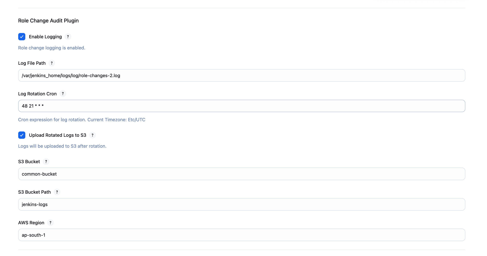
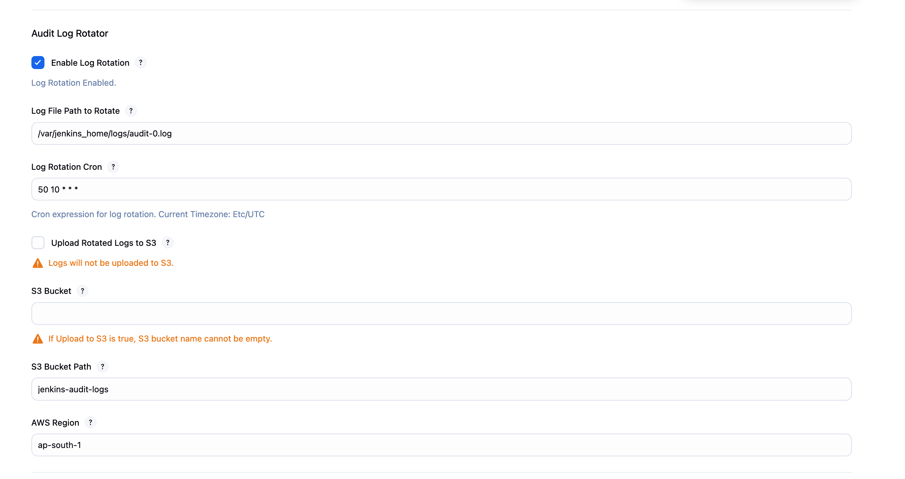

# role-change-audit-plugin

## Introduction

Role Based Strategy Audit Plugin allows user to capture audit logs for any change done in role-based authorization via role-based strategy authorization plugin.

## Getting started

Install the plugin and configure it inside Manage Jenkins > System configuration.
There are 2 part of this plugin.
1. Role Change Auditor - This Auditor logs each and every change in Role based strategy authorization configuration, roatates the logs and uploads them to S3.
2. Audit Log Rotator - This Rotator utility rotates and uploads Audit Trail log files to S3.

### Role Change Auditor Configuration

### Audit Log Rotator Configuration

## LICENSE

Licensed under MIT, see [LICENSE](LICENSE.md)

